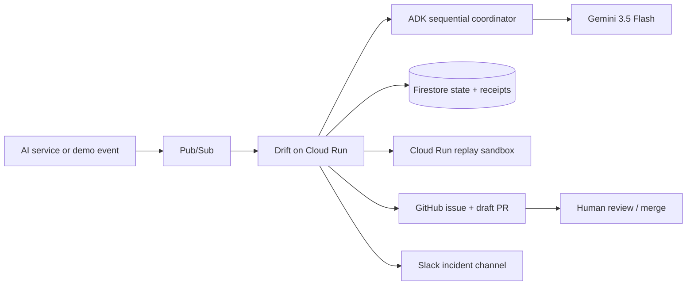

# Drift

> **From agent failure to validated pull request.**

Drift is an event-driven AI incident responder built for the **Taskmaster** track of the
All Things Agentic Hackathon. It receives a failed AI workflow, identifies the evidence
gap with Gemini 3.5 Flash and Google ADK, creates a GitHub incident, produces a constrained
candidate fix, proves the fix through live replay, opens a draft pull request, and posts
the result to Slack. Drift never merges or deploys production changes.

## Why Drift exists

AI systems commonly fail at the boundary between a model and its tools. A timeout or empty
lookup becomes a confident guess; the operator gets an alert, but still has to reconstruct
the trace, write a ticket, draft a change, test it, and notify the team.

Drift completes that workflow. Its differentiator is **proof-carrying remediation**: every
draft pull request includes the original failure, adversarial replay cases, before/after
pass rates, and the explicit human approval boundary.

## Workflow



1. Accept and normalize an authenticated Pub/Sub event.
2. Claim `{source}:{event_id}` transactionally so redelivery is safe.
3. Triage, investigate, and route the incident through the ADK coordinator.
4. Create a GitHub issue and notify Slack.
5. Generate a patch restricted to an allow-listed prompt or policy file.
6. Replay the original failure and adversarial cases against the sandbox.
7. Open a draft PR only when the candidate passes every validation case.
8. Post the result to Slack and wait for a person to review the PR.

## Required hackathon stack

- **Reasoning:** `gemini-3.5-flash` through Vertex AI's `global` model endpoint.
- **Agent framework:** Google ADK `Workflow` with sequential Triage, Investigation,
  Remediation, and Validation edges.
- **Infrastructure:** Cloud Run, Pub/Sub, Firestore, Secret Manager, Cloud Logging,
  Cloud Build, and Artifact Registry.
- **Actions:** GitHub REST API and Slack incoming webhooks.

The local deterministic backend is visibly marked as demo mode. Set
`DRIFT_REASONING_BACKEND=gemini_adk` for the judged cloud path.

## Run the complete local demo

Requirements: Python 3.11+, Node.js 20+, and `uv`.

```powershell
Copy-Item .env.example .env
uv sync --extra dev
Push-Location web; npm ci; Pop-Location
./scripts/demo.ps1
```

The script starts:

- Drift API at <http://localhost:8080>
- Replay sandbox at <http://localhost:8082>
- Operations Room at <http://localhost:5173>

Click **Trigger live proof** and enter the default local token from `.env.example`.
The local workflow uses dry-run GitHub and Slack adapters but creates the same durable
action receipts, links, replay evidence, and terminal state as the live path.

### Run services manually

```powershell
uv run uvicorn demo_target.api:app --port 8082
uv run uvicorn drift.api:app --port 8080
Set-Location web; npm run dev
```

### Run verification

```powershell
uv run pytest -q
uv run ruff check .
uv run mypy drift demo_target
uv run drift-brand-guard
Push-Location web; npm test; npm run build; Pop-Location
docker build -f deploy/Dockerfile -t drift:local .
```

## Live action configuration

Keep `ACTION_MODE=dry-run` until the `drift` repository and demo Slack channel are ready.
For live mode:

1. Create a fine-grained GitHub token restricted to one repository with Contents, Issues,
   and Pull Requests write permission.
2. Create a Slack incoming webhook restricted to the demo incident channel.
3. Store both values in Secret Manager as `drift-github-token` and
   `drift-slack-webhook`.
4. Set the exact GitHub owner, repository, base branch, and allowed paths.
5. Deploy with `ACTION_MODE=live`; the health endpoint must report
   `live_actions_ready: true` before recording the demo.

The production replay sandbox is private; Drift signs each Cloud Run replay request with its
dedicated Google service identity. See [deployment](docs/DEPLOYMENT.md),
[architecture](docs/ARCHITECTURE.md), and [security](docs/SECURITY.md) for the complete
production setup.

## Public API

| Method | Route | Purpose |
|---|---|---|
| `POST` | `/v1/events/pubsub` | Authenticated Pub/Sub push receiver |
| `POST` | `/v1/demo/incidents` | Bearer-protected deterministic demo trigger |
| `GET` | `/v1/incidents` | Recent incident summaries |
| `GET` | `/v1/incidents/{id}` | Complete workflow and action ledger |
| `GET` | `/v1/incidents/{id}/events` | Stored timeline |
| `GET` | `/v1/events/stream` | Live SSE workflow events |
| `GET` | `/v1/health` | Sanitized runtime and cloud proof |

## Repository map

```text
drift/          workflow, ADK graph, safety policy, state, integrations, API
demo_target/    deterministic Cloud Run replay sandbox
web/            responsive React operations room
deploy/         container and Google Cloud deployment configuration
tests/          unit, contract, security, and end-to-end verification
docs/           architecture, deployment, demo, and submission materials
licence/        pre-existing-code and third-party compliance records
```

## Pre-existing code disclosure

Drift incorporates selected pre-existing Apache-2.0 infrastructure; the precise scope and
contributor record are documented in [`licence/`](licence/). The Taskmaster workflow,
Google event architecture, integrations, interface, deployment, and submitted behavior
were built or substantially rewritten for this hackathon.

## License

Apache-2.0. See [LICENSE](LICENSE) and [third-party notices](licence/THIRD_PARTY_NOTICES.md).
