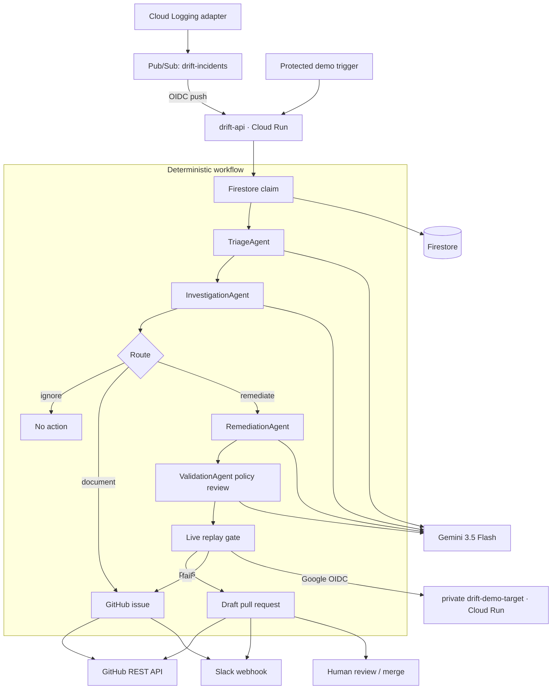

# Drift architecture

## Design goal

Drift turns an AI failure event into a reversible, evidence-backed remediation package.
Reasoning proposes and evaluates; deterministic code owns credentials, state transitions,
path policy, API calls, and the human approval boundary.



## State model

`WorkflowRun` is the durable aggregate. Its stage advances through:

```text
ingested → deduplicated → triaged → investigated → routed
  ├─ ignore → ignored
  ├─ document → issue_created → documented
  └─ remediate → issue_created → candidate_generated → validated
       ├─ fail → documented
       └─ pass → pr_opened → notified → awaiting_review
```

Any unhandled error becomes `failed` with a redacted error. It never silently advances.

Firestore layout:

```text
drift_incidents/{incident_id}
  events/{generated_id}
  actions/{source:event_id:action_kind}
drift_incidents_claims/{source:event_id}
```

The claim document prevents duplicate workflows. Action receipts prevent duplicate
external effects after a completed delivery. GitHub branches and incident titles are also
deterministic so operators can identify and reconcile an interrupted action.

## Agent architecture

The production reasoner is an ADK `Workflow` with a deterministic sequential graph:

- **TriageAgent** — severity, category, confidence, evidence, and route.
- **InvestigationAgent** — root cause and smallest safe policy change.
- **RemediationAgent** — complete replacement content for the authorized file only.
- **ValidationAgent** — independent policy review before deterministic replay.

Inputs are explicitly labeled untrusted. ADK outputs are validated against Pydantic
schemas. No agent receives GitHub, Slack, shell, or Secret Manager credentials.

The API and replay sandbox run as separate service accounts. The sandbox is not public;
the API obtains a Google-signed identity token with the sandbox URL as its audience. Cloud
Build also uses a dedicated identity that can deploy services but cannot read runtime
secrets.

## Action isolation

The workflow, not the model, builds every external request. A proposal is rejected unless:

- repository, branch, and file path match configuration exactly;
- the baseline SHA-256 matches the incident;
- the diff is below the maximum size;
- the risk is low or medium;
- replay passes every case and improves the baseline.

The final GitHub artifact is always a draft PR. There is intentionally no merge API.
